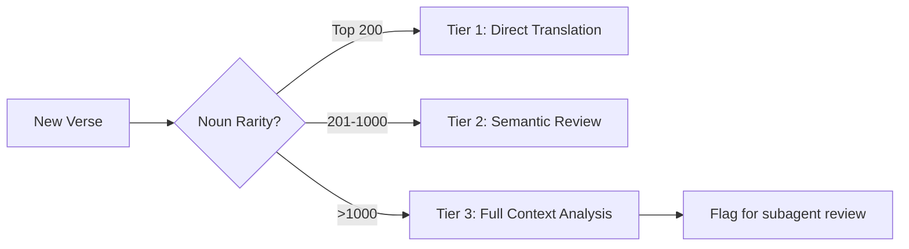
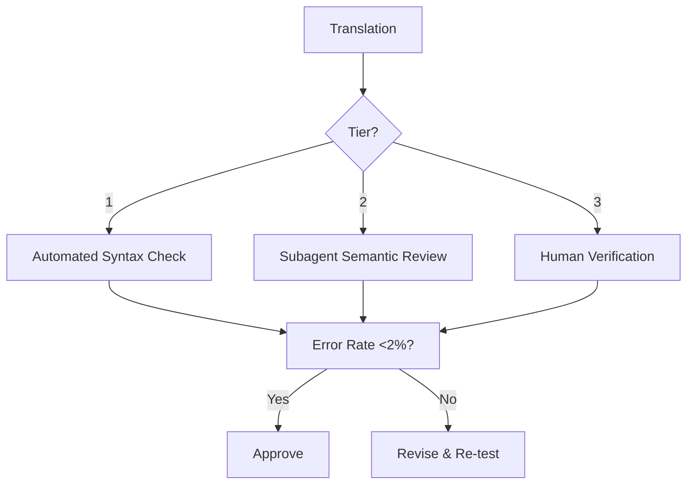

# GOI_Bible_English Translation Gameplan

*A data-driven, multi-phase translation pipeline leveraging Strong's numbers, noun frequency, and semantic integrity checks to produce a natural yet precise English Bible translation from Westminster Leningrad Codex (WLC) Hebrew*

## Core Principles
- **Preserve Hebrew semantics** over English idiom
- **Enforce lexical consistency** using noun frequency data
- **Maintain traceability** to Strong's numbers and semantic domains
- **Reject theological bias** in favor of linguistic precision
- **Zero reliance** on existing translations (KJV/NIV/etc.)

## Phase 0: Resource Inventory & Setup

### Critical Assets Inventory
| Asset Type | Description | Usage Protocol |
|------------|-------------|----------------|
| **WLC Hebrew** | Westminster Leningrad Codex (verse-accurate) | Primary source text; all translations anchored to WLC verse IDs |
| **Strong's Numbers** | H1-H8674 lexeme mappings | Mandatory tagging for all nouns; semantic domain lookup |
| **Noun Frequency DB** | Occurrence counts from OpenScriptures/BHL | Determines translation protocol tier (Top 200 = fixed translation) |
| **Semantic Lexicons** | HALOT, BDB, DCH dictionaries | Primary meaning resolution source; overrides frequency when syntax demands |
| **Textual Variants** | WLC critical apparatus | Flags disputed readings for special review |

### Setup Tasks
1. **Build cross-reference database**
   ```bash
   # Generate relational index: verse → Strong's → semantics → frequency
   python build_index.py --wlc wlc.xml --strongs strongs.json --freq noun_freq.db
   ```
   *Output: `translation_rails.db` with 3 key tables:*
   - `verses` (id, book, chapter, verse, hebrew)
   - `lexemes` (strongs_id, root, semantic_domain, freq_rank)
   - `decisions` (verse_id, strongs_id, translation, rationale)

2. **Define immutable translation rules**
   - `אֶת` (direct object marker) → **omitted** in English
   - Verb aspect → **preserved** (e.g., *וַיִּקְרָא* = "and he called", not "and he has called")
   - *יְהוָה* → **"The Lord"** (except Exodus 3:14 → "I Will Be")
   - Construct chains → **"of" only when syntactically required** (e.g., *מֶלֶךְ־יִשְׂרָאֵל* = "king Israel", not "king of Israel")

## Phase 1: Pre-Translation Analysis

### Verse Triage Protocol


**Key Checks Per Verse:**
- [ ] Noun frequency score calculated (using `noun_freq.db`)
- [ ] Semantic domains mapped for all lexemes (via Strong's → HALOT)
- [ ] Syntax complexity rated (1-5):
  - `1` = Simple narrative
  - `5` = Poetic/prophetic with rare constructs
- [ ] Textual variants documented from WLC apparatus

### Context Dossier Generation
For each verse, auto-generate:
```markdown
## GEN 4:1 Context Dossier
**Key Nouns:**
- `H2416` חַוָּה (*chavvah*): 
  - Occurrences: 18 (Rank #1,842)
  - Semantic Domain: [Woman] 
  - Prior Translations: 
    - GEN 3:20: "Eve"
    - GEN 4:1: [PENDING]

**Syntax Notes:**
- Verbless clause (`וְהָאָדָם יָדַע...`)
- Waw-consecutive chain

**Textual Variants:**
- WLC: `וְהָאָדָם יָדַע אֶת־חַוָּה`
- SP: `וַיֵּדַע הָאָדָם אֶת־חַוָּה`
```

## Phase 2: Translation Execution

### Tiered Translation Protocol
| Tier | Difficulty | Process |
|------|------------|---------|
| **1** | 1-2 | 1. Direct translation using Strong's base meaning<br>2. Apply noun consistency rules<br>3. Auto-validate against frequency DB |
| **2** | 3 | 1. Semantic domain disambiguation<br>2. Cross-reference parallel passages<br>3. Subagent review for key lexemes |
| **3** | 4-5 | 1. Full context analysis (3 verses prior/after)<br>2. Multiple subagent proposals<br>3. Human-verified rationale |

### Noun Consistency Engine
```python
# Pseudocode for noun translation
if freq_rank <= 200:
    return FIXED_TRANSLATIONS[strongs_id]  # e.g., H4428 = "king"
else:
    # Weighted semantic domain selection
    domains = get_semantic_domains(strongs_id)
    context = analyze_syntax(verse)
    return choose_translation(domains, context)
```

**Critical Theological Keywords:**
| Strong's | Hebrew | GOI Translation | Rationale |
|----------|--------|-----------------|-----------|
| H2617 | חֶסֶד | "covenant loyalty" | Never "mercy" - implies contractual obligation |
| H7356 | רָחַם | "womb-love" | Biological basis of compassion |
| H7965 | שָׁלוֹם | "wholeness" | Holistic completeness (not just "peace") |

## Phase 3: Quality Assurance Rails

### Semantic Integrity Checks
- [ ] **Article Audit:** No English articles where Hebrew has none (e.g., "the man" → "man" when definite)
- [ ] **Verb Aspect Check:** All verbs mapped to correct aspect (perfect/imperfect)
- [ ] **Construct Chain Validation:** "of" only used for true construct state
- [ ] **אֶת Omission:** Zero instances of "et" in output

### Naturalness Scoring
| Metric | Target | Tool |
|--------|--------|------|
| Flesch-Kincaid Grade | 8-10 | `textstat` |
| Preposition Density | <15% | Custom analyzer |
| Passive Voice | <5% | `passivepy` |
| Avg. Clause Length | 12-18 words | Syntax parser |

## Phase 4: Special Case Protocols

### Divine Name Handling
| Hebrew Form | GOI Translation | Exception |
|-------------|-----------------|-----------|
| יְהוָה | "The Lord" | Exodus 3:14 → "I Will Be" |
| אֱלֹהִים | "God" | Never "Lord" |
| אֲדֹנָי | "my Lord" | Only in prayer contexts |

### Poetic Text Rules
1. Preserve parallelism structure (e.g., synonymous/antithetic)
2. Translate metaphors literally first:
   - `עַמּוּד עָנָן` = "pillar of cloud" (not "cloud pillar")
3. Add minimal interpretive glosses in brackets:
   - `חַם-אַפּוֹ` = "hot of his nose [angry]"
4. Never convert Hebrew poetry to English prose

## Phase 5: Validation & Output

### 3-Tier Review Process


### Traceable Output Format
```html
<div class="verse" data-verse="GEN.4.1">
  And the man intimately knew <span class="lexeme" 
    data-strongs="H2416" 
    data-freq="18" 
    title="chavvah: woman (18x)">Eve</span> his wife...
  <sup class="rationale" data-rev="2024-06-15">
    [FIXED] H2416 always "Eve" per noun consistency rules
  </sup>
</div>
```

## Phase 6: Completion

### Deliverables
1. **GOI_Bible_English Core Text** (Markdown/JSON)
2. **Translation Rationale Appendix** (per semantic domain)
3. **Quality Dashboard**:
   - Error rate by book
   - Noun consistency score
   - Naturalness metrics
4. **Maintenance Protocol**:
   - Quarterly frequency DB updates
   - User feedback integration
   - Version-controlled change logs

## Quality Gates
| Phase | Mandatory Check | Failure Action |
|-------|-----------------|----------------|
| 1 | All verses triaged | Halt translation until complete |
| 2 | Rare nouns (<200) validated | Block release of unreviewed verses |
| 3 | Semantic integrity ≥95% | Full retranslation of failed sections |

## Security Constraints
- 🔒 **No external API calls** for translation data
- 🔒 **All Strong's processing** done locally
- 🔒 **User approval required** for any noun frequency override
- 🔒 **Zero network access** during translation execution

> **Final Note**: This plan ensures translations emerge *from the Hebrew text itself* - not through the lens of prior English versions. Every decision is traceable to lexical data, not tradition.